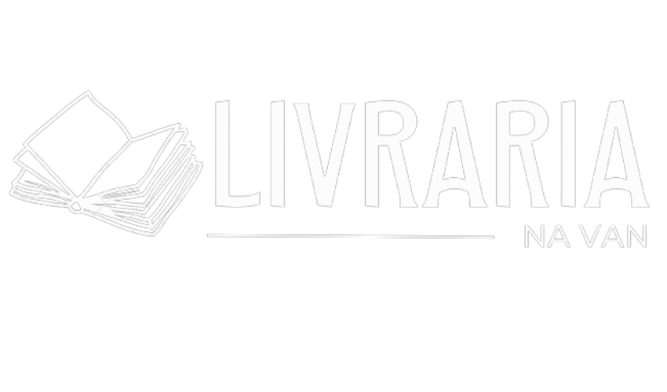

# 📚 Livraria na Van 🚐


Livraria na Van é uma livraria itinerante fictícia, criada para fins didáticos para o projeto de final de módulo 5 do curso de desenvolvimento web da <a href="https://www.resilia.com.br/">Resilia Educação</a>.<br/>
O frontend foi desenvolvido consumindo a API do estoque da Livraria criado no módulo 4, que pode ser acessado <a href="https://github.com/vanessacreis/Bookstore-API">aqui</a>.<br/>

## 

## 📚 Tecnologias utilizadas ⚙️

- React.JS
- Styled-Components
- React-Router-Dom
- Axios
- React-Slick
- React-Toastify
- Slick-Carousel
- React-Leaflet

---

## 📚 Como executar 🏁

Execute os comandos a seguir no terminal ou PowerShell:

- Clone o repositório:

```
$ git clone https://github.com/vanessacreis/bookstoreapp.git
```

- Acesse a pasta

```
cd bookstoreapp
```

- Instale as dependências necessárias

```
npm install
```

- Inicie o servidor local

```
npm start
```

---


### 📚 Deploy 🌐

A aplicação funcionando pode ser visualizada no deploy, você pode acessá-lo <a href="https://bookstoreapp.vercel.app/">aqui</a>.

---

## 📚 Desenvolvedores

- <a href="https://www.linkedin.com/in/brunoasantanadesa/">Bruno Santana de Sá</a>
- <a href="https://www.linkedin.com/in/luziane-gering-729ba7180/">Luziane Gering</a>
- <a href="https://www.linkedin.com/in/pedro-santos20/">Pedro Santos</a>
- <a href="https://www.linkedin.com/in/thiago-pgc/">Thiago Pereira</a>
- <a href="https://www.linkedin.com/in/vanessacreisbh/">Vanessa Reis</a>
